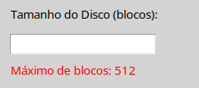
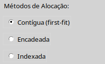
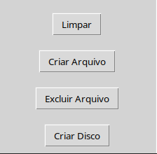
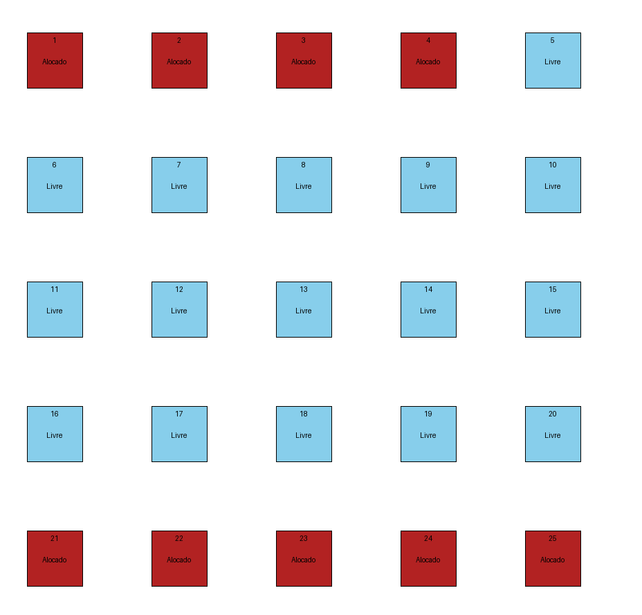
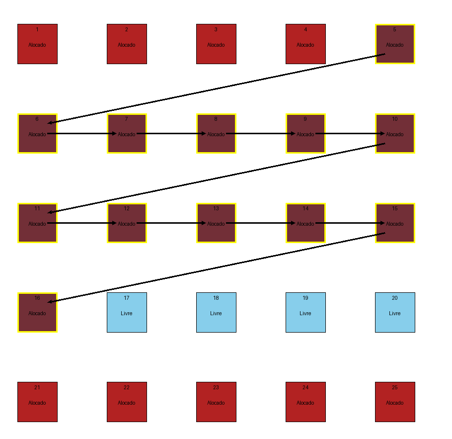
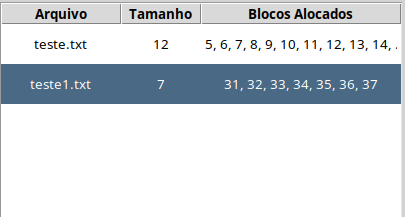
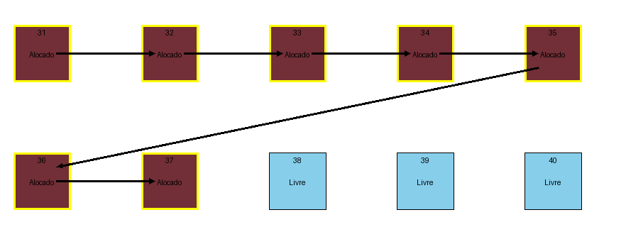
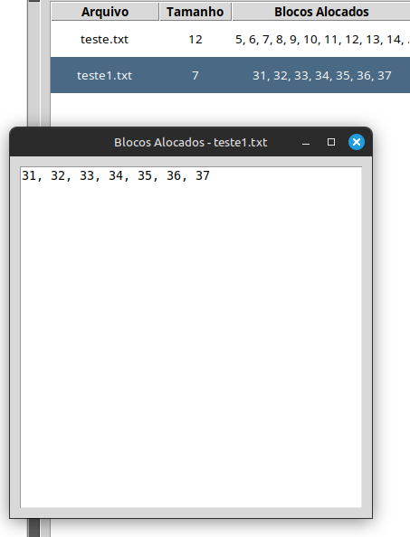

# Como Configurar e Rodar a Aplicação

Siga os passos abaixo para configurar e executar o projeto:

## 1. Abra o projeto e acesse sua pasta
```bash
$ cd caminho/para/o/projeto
```

## 2. Verifique se o Python 3 está instalado
Certifique-se de que o Python 3 está disponível no sistema:
```bash
$ which python3
```
O comando deve retornar:
```
/usr/bin/python3
```

## 3. Instale os pacotes necessários
Instale os seguintes módulos para preparar o ambiente:

### Módulo para criar ambientes virtuais
```bash
$ sudo apt-get install python3-venv
```

### Gerenciador de pacotes Python (pip)
```bash
$ sudo apt-get install python3-pip
```

### Tkinter - Biblioteca de interface gráfica para Python
```bash
$ sudo apt-get install python3-tk
```

## 4. Crie o ambiente virtual
No diretório do projeto, crie o ambiente virtual:
```bash
$ python3 -m venv .venv
```

## 5. Ative o ambiente virtual
Ative o ambiente virtual criado:
```bash
$ source ./.venv/bin/activate
```

## 6. Instale as dependências
Com o ambiente virtual ativado, instale os pacotes listados no arquivo `requirements.txt`:
```bash
$ pip install -r ./requirements.txt
```

## 7. Execute a aplicação
Rode o aplicativo principal:
```bash
$ python3 ./src/main.py
```

# Descrição do Simulador de Alocação de Blocos Lógicos

Este é um aplicativo interativo desenvolvido em Python utilizando **Tkinter** para simular diferentes métodos de alocação de blocos lógicos em sistemas de arquivos. Ele permite ao usuário criar um disco lógico, adicionar arquivos usando métodos de alocação, visualizar a alocação de blocos e gerenciar arquivos simulados. O aplicativo oferece um ambiente visual educativo para explorar como os métodos de alocação funcionam.

## Funcionalidades Principais

#### 1. Configuração do Disco
- O aplicativo permite criar um disco lógico especificando o tamanho (em blocos), com o limite máximo de 512 blocos.
- O disco é visualizado como uma grade de blocos que podem estar livres ou alocados.
- Diferentes cores representam os estados dos blocos:
  - **Azul-claro:** bloco livre.
  - **Vermelho:** bloco ocupado.

#### 2. Métodos de Alocação
O usuário pode escolher entre três métodos de alocação:
1. **Contígua (First-Fit):**
   - Os blocos do arquivo são alocados consecutivamente, exigindo que todos os blocos estejam livres em sequência.
   - Se não houver espaço contíguo suficiente, a alocação falha.
   - Setas são desenhadas entre os blocos para ilustrar a sequência de alocação.

2. **Encadeada:**
   - Os blocos do arquivo são alocados de forma dispersa.
   - Cada bloco aponta para o próximo usando setas, simulando uma lista encadeada.
   - Permite maior flexibilidade na utilização do espaço do disco.

3. **Indexada:**
   - Um bloco especial é reservado como **bloco índice**, contendo referências para todos os blocos alocados do arquivo.
   - É ideal para arquivos grandes e dispersos.
   - Setas são desenhadas do bloco índice para cada bloco alocado.

#### 3. Gerenciamento de Arquivos
- **Criação de Arquivos:**
  - O usuário pode criar um arquivo especificando o nome e o tamanho (em blocos).
  - O método de alocação escolhido no momento da criação do disco será utilizado.
  - Se não houver blocos livres suficientes para o arquivo, uma mensagem de erro é exibida.
  
- **Exclusão de Arquivos:**
  - Arquivos podem ser excluídos pelo nome.
  - Os blocos ocupados pelo arquivo são liberados, e as setas associadas são removidas.
  
- **Atualização da Tabela:**
  - A tabela à direita exibe informações sobre os arquivos, incluindo:
    - Nome do arquivo.
    - Tamanho (número de blocos alocados).
    - Lista dos blocos alocados (até um limite, com possibilidade de exibir mais detalhes em uma nova janela, só dar um duplo clique).

#### 4. Interface Visual
- **Barra Lateral (Configurações e Controles):**
  - Entrada de dados para configurar o disco e criar arquivos.
  - Seleção de métodos de alocação e níveis de dificuldade.
  - Botões para ações como criar disco, criar arquivo, excluir arquivo e limpar o canvas.

- **Canvas Central:**
  - Exibe a grade de blocos representando o disco lógico.
  - As cores e setas indicam o estado e o relacionamento entre blocos alocados.

- **Tabela de Arquivos:**
  - Exibe uma visão geral dos arquivos e seus blocos alocados.

#### 5. Níveis de Dificuldade
- O aplicativo oferece três níveis de dificuldade (Fácil, Médio, Difícil) para simular discos com blocos já ocupados, representando um disco em uso real:
  - **Fácil:** Menos blocos ocupados inicialmente.
  - **Médio:** Número moderado de blocos ocupados.
  - **Difícil:** Alta ocupação inicial, tornando a alocação mais desafiadora.

## Como Funciona

1. **Criação do Disco**
   - O usuário define o tamanho do disco (número de blocos).
   - O disco é representado como uma grade de blocos, cada um com um ID exclusivo.

2. **Seleção do Método de Alocação**
   - O método é selecionado antes da criação do disco.
   - A escolha do método afeta como os blocos serão alocados para arquivos.

3. **Adição de Arquivos**
   - O usuário define o nome e o tamanho do arquivo.
   - O aplicativo tenta alocar os blocos conforme o método selecionado:
     - **Contígua:** Busca uma sequência livre de blocos no disco.
     - **Encadeada:** Seleciona blocos aleatórios e cria links entre eles.
     - **Indexada:** Reserva um bloco como índice e aloca blocos dispersos.

4. **Exclusão de Arquivos**
   - Quando um arquivo é excluído, seus blocos são liberados e podem ser reutilizados.
   - As setas e associações visuais são removidas.

5. **Visualização**
   - O canvas é atualizado para refletir o estado atual do disco.
   - Setas são desenhadas para ilustrar as relações entre blocos alocados.


### Exemplo de Uso
1. Configure o tamanho do disco e escolha um método de alocação.
    - Informe o tamanho do disco
      - 
    - Escolha o método de alocação
      - 
2. Crie o disco e visualize sua estrutura.
    - Clique no botão 'Criar Disco'
      - 
    - Exemplo
      - 
3. Adicione arquivos com diferentes tamanhos e veja como os blocos são alocados.
    - Informe os campos 'Nome do arquivo' e 'Tamanho do Arquivo'. E então clique no botão 'Criar Arquivo'
      - 
    - Exemplo método contíguo
      - 
    - O simulador mantém uma tabela com os arquivos alocados e seus blocos
      - 
    - Quando é clicado em cima do arquivo da tabela, é destacado aonde está localizado esse arquivo
      - 
    - Para casos onde temos muitos índices alocados, para facilitar a visualização é só dar um duplo clique em cima do arquivo na tabela de alocação que o simulador mostra os índices alocados **em ordem**
      - 
4. Exclua arquivos para liberar espaço.
    - Para excluir, insira o nome do arquivo no campo 'Nome do Arquivo', ou clique em cima do arquivo na tabela de alocação
      - 
    - E então clique no botão de 'Excluir Arquivo'
      - 
5. Caso queira recomeçar do zero.
    - Clique em 'Limpar'
      - 
